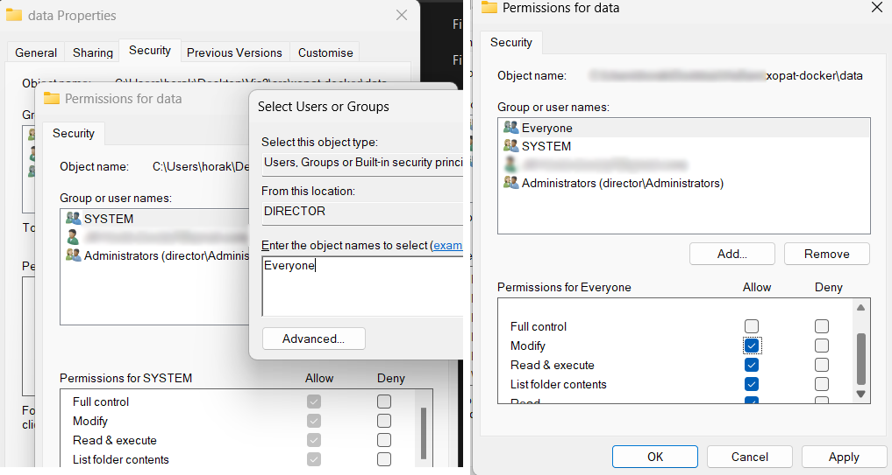

## Mirax Importer

Simple Web Interface for mirax files uploading, conversion and processing.
Access as 
> http://localhost:8081/importer/

The docker needs to have write access to `[docker repo root]/data` folder. Create one if
it does not exist.

For linux,
you can simply set `chmod a+rwx` to this folder, or solve it in a more
secure way with user groups.

For windows, you have to unfortunately open the folder properties, 
choose to edit the folder access rights and add new entity `Others`
for which you set up write access.

Access the running container as
> `docker exec -it mirax_importer bash`

### Tools used
The importer is a very usecase-specific deployment that integrates
various tools necessary for MIRAX loading and processing such as 
`vips`, `snakemake`, `python`, `php`, uses `mirax_venv` virtual
environment and overall might not be what you are looking for.
It is not recommended using AS-IS, it's something we use
for very basic MIRAX files management and processing and
it is very specific to our use-case.